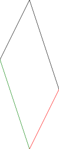
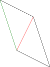
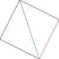

### 기본성질

$\textbf{u}, \textbf{v}, \textbf{w}$가 $\!R^n$의 벡터들이고, $k,l$이 스칼라이면

* $\textbf{u} + \textbf{v} = \textbf{v} + \textbf{u}$
* $(\textbf{u} + \textbf{v}) + \textbf{w} = \textbf{v} + (\textbf{u} + \textbf{w})$
* $\textbf{u} + 0 = 0 + \textbf{u} = \textbf{u}$
* $\textbf{u} + (-\textbf{u}) = 0$
* $(k + l)\textbf{u} = k\textbf{u} + l\textbf{u}$
* $k(\textbf{u} + \textbf{v}) = k\textbf{u} + k\textbf{v}$
* $k(l\textbf{u}) = (kl)\textbf{u}$
* $1\textbf{u} = \textbf{u}$

## 놈(norm)

$\textbf{v}=(v_1, v_2, ..., v_n)$이 $\!R^n$의 벡터이면 $\textbf{v}$의 길이(length) 또는 놈(norm) 혹은 크기(magnitude)는 $\|\textbf{v}\|$로 표시하며 다음과 같이 정의한다.

$$
\|\textbf{v}\| = \sqrt{a^2 + b^2}
$$

### 정리 1.2.2

$\textbf{v}$가 $\!R^n$의 벡터이고 $k$가 임의가 스칼라이면 다음이 성립한다.

* (a) $\|\textbf{v}\| \ge 0$
* (b) $\|\textbf{v}\| = 0 \iff \textbf{v} = 0$
* (c) $\|k\textbf{v}\| = |k|\|\textbf{v}\|$

## 단위벡터(unit vector)

길이가 1인 벡터를 단위벡터라 한다. 만약 $\textbf{v}$가 $\!R^n$의 영이 아닌 벡터이먼 $\textbf{v}$와 같은 방향을 갖는 단위벡터는 $\textbf{u}$는 다음 식으로 구한다.

$$
\textbf{u} = \frac{1}{\|\textbf{v}\|}\textbf{v}
$$

## 표준단위벡터(standard unit vector)

직교좌표계에서 양의 좌표축 방향의 단위벡터들을 표준단위벡터라 한다.

## 내적

내적은 다음과 같이 정의된다.

$$
\textbf{u}\cdot\textbf{v} = \sum_{k=1}^n u_kv_k
$$

### 정리 1.2.6

만약 $\textbf{u}, \textbf{v}, \textbf{w}$가 $\!R^n$의 벡터이고 $k$가 실수이면

* (a) $\textbf{u} \cdot \textbf{v} = \textbf{v} \cdot \textbf{u}$
* (b) $\textbf{u} \cdot (\textbf{v} + \textbf{w}) = \textbf{u} \cdot \textbf{v} + \textbf{u} \cdot \textbf{w}$
* (c) $k(u \cdot \textbf{v}) = (ku) \cdot \textbf{v}$
* (d) $\textbf{v} \cdot \textbf{v} \ge 0$ and $\textbf{v} \cdot \textbf{v} = 0 \iff \textbf{v} = 0$ 

### 정리 1.2.7

만약 $\textbf{u}, \textbf{v}, \textbf{w}$가 $\!R^n$의 벡터이고 $k$가 스칼라이면

* (a) $0 \cdot \textbf{v} = \textbf{v} \cdot 0 = 0$
* (b) $(\textbf{u} + \textbf{v}) \cdot \textbf{w} = \textbf{u} \cdot \textbf{w} + \textbf{v} \cdot \textbf{w}$
* (c) $\textbf{u} \cdot (\textbf{v} - \textbf{w}) = \textbf{u} \cdot \textbf{v} + \textbf{u} \cdot \textbf{w}$
* (d) $(\textbf{u} - \textbf{v}) \cdot \textbf{w} = \textbf{u} \cdot \textbf{w} - \textbf{v} \cdot \textbf{w}$
* (e) $k(\textbf{u} \cdot \textbf{v}) = \textbf{u} \cdot (k \textbf{v})$

### 정리 1.2.8

만약 $\textbf{u}$와 $\textbf{v}$가 $\!R^n$의 벡터들이고 $\theta$가 이들 벡터의 사잇각이라 하면

$$
\cos \theta = \frac{\textbf{u} \cdot \textbf{v}}{\|\textbf{u}\|\|\textbf{v}\|}
$$

### 정리 1.2.9

$\!R^2$의 벡터 $\textbf{u}$와 $\textbf{v}$가 직교한다(orthogonal)는 건은 $\textbf{u} \cdot \textbf{v} = 0$을 만족시키는 것을 말하며, 공집합이 아닌 $\!R^n$의 벡터들의 집합이 직교집합(orthogonal set)이라는 것은 이 집합의 임의의 서로 다른 한 쌍의 벡터가 직교하는 것을 말한다.

### 정리 1.2.10

$\!R^n$의 두 벡터 $\textbf{u}$와 $\textbf{v}$가 정규직교(orthogonarmal)라는 것은 이들이 직교하고 길이가 1인 경우를 뜻하고, 벡터들의 집합이 정규직교집합(orthogonarmal set)이라는 것은 이 집합의 모든 벡터들의 길이가 1이고 이 집합 속의 서로 다른 임의의 한 쌍의 벡터들이 직교하는 경우를 뜻한다.

### Pythagoras 정리

만약 $\textbf{u}$와 $\textbf{v}$가 $R^n$의 벡터이면

$$
\|\textbf{u} + \textbf{v}\|^2 = \|\textbf{u}\|^2 + \|\textbf{v}\|^2
$$

### $\R^n$ Cauchy-SChwarz 부등식

만약 $\textbf{u}$와 $\textbf{v}$가 $R^n$의 벡터이면

$$
(\textbf{u} \cdot \textbf{v}) \le \|\textbf{u}\|^2 \|\textbf{v}\|^2
$$

### 벡터에 관한 삼각부등식

만약 $\textbf{u}, \textbf{v}, \textbf{w}$가 $\!R^n$의 벡터이면

$$
\|\textbf{u}+\textbf{v}\| \le \|\textbf{u}\| + \|\textbf{v}\|
$$

## 직선과 평면의 벡터방정식

### 직선의 벡터방정식

$$
\textbf{x} = \textbf{x}_0 + t\textbf{v}
$$

### 두 점을 지나는 직선

$$
\textbf{x}= \textbf{x}_0 + t(\textbf{x}_1 - \textbf{x}_0)
$$

### 평면의 점-법선형 방적식

$\!R^3$ 내의 평면은 이 평면 안의 한 점 $\textbf{x}_0$과평면에 수직인 벡터 $\textbf{n}$에 의해서 유일하게 결정된다. 이 때의 $\textbf{n}$을 평면의 법선벡터(normal vector)라 한다. 만약 $\textbf{x}$가 평면 상의 한 점이면 벡터 $\textbf{x} - \textbf{x}_0$은 $\textbf{n}$과 직교하게 되어 다음 공식이 성립한다.

$$
\textbf{n} \cdot (\textbf{x} - \textbf{x}_0) = 0
$$

### 평면의 벡터 및 매개변수방정식

$$
\textbf{n} = \textbf{x}_0 + t_1\textbf{v}_1 + t_2\textbf{v}_2s
$$

### 세 점을 지나는 평면 벡터방정식

$$
\textbf{x} = \textbf{x}_0 + t_1(\textbf{x}_1 - \textbf{x}_0) + t_2(\textbf{x}_2 - \textbf{x}_0)
$$

## 연습문제 (p. 19)

* 6 (a) (-5,0), (b) (-3,4,0)
* 9 (a) (2,3), (b) (-2,-2,-1)
* 12 
(a) $(7,5,-5,-1,5)$,
(b) $(6,0,-15,27,-6)$,
(c) $(-3,2,7,-12,4)$
* 15 (a)
* 18 (18,1)
* 21 

* 24

### 증명

P1. 

$$
(k + l)\textbf{u} \\
= ((k + l)u_1,(k + l)u_2, ... (k + l)u_n) \\
= (ku_1 + lu_1,ku_1 + lu_1, ... ku_n + lu_n) \\
= k\textbf{u} + l\textbf{u}
$$

P3. 

(a)

$$
0\textbf{v} = 0\textbf{v} \\
(0 + 0)\textbf{v} = 0\textbf{v} \\
0\textbf{v} + 0\textbf{v} = 0\textbf{v} \\
0\textbf{v} + 0\textbf{v} - 0\textbf{v} = 0\textbf{v} - 0\textbf{v} \\
0\textbf{v} = 0
$$
\
(c)

$$
0\textbf{v} = 0 \\
(1 + (-1))\textbf{v} = 0 \\
1\textbf{v} + (-1)\textbf{v} = 0 \\
\textbf{v} + (-1)\textbf{v} = 0 \\
v + (-v) + (-1)\textbf{v} = 0 + (-\textbf{v}) \\
(-1)\textbf{v} = -\textbf{v}
$$

## 연습문제 (p. 40)

P1. $\|\textbf{u}_1 + \textbf{u}_2 + ... + \textbf{u}_n\|^2 = \|\textbf{u}_1\|^2 + \|\textbf{u}_2\|^2 + ... + \|\textbf{u}_n\|^2$ 임을 증명하라.

P2. 다음 부등식을 증명하라.

$$
\frac{a_1 + a_2}{2}  = \sqrt{a_1a_2}
$$
$\textbf{u} = (\sqrt{a_1}, \sqrt{a_2}), \textbf{v} = (\sqrt{a_2}, \sqrt{a_1})$ 일 때,

$$
∣\textbf{u}⋅\textbf{v}∣^2 \le \|\textbf{u}\|^2\|\textbf{v}\|^2\\
(a_1 + a_2)^2 = (2\sqrt{a_1a_2})^2 \\
a_1 + a_2 = 2\sqrt{a_1a_2} \\
\frac{a_1 + a_2}{2}  = \sqrt{a_1a_2}
$$

P4.

$$
y = mx \\
b = ma \\
b/a = m
$$